# 🏛️ ĐẶC TẢ TOÀN DIỆN WEBAPP, CODEGRAPH & BÀI HỌC KINH NGHIỆM XƯƠNG MÁU
# Hệ Thống Quản Lý Tín Dụng & Trích Nợ Tự Động CreditCores — QTDND Yên Thọ
# Phiên bản tài liệu: v3.2 — Ngày cập nhật: 16/09/2026

Tài liệu này đóng vai trò là **Kim Chỉ Nam Nghiệp Vụ, Bản Đồ Kỹ Thuật (CodeGraph) và Trí Nhớ Vĩnh Viễn (Agent Memory)** cho hệ thống **CreditCores** (Quỹ Tín Dụng Nhân Dân Yên Thọ).
Mọi kỹ sư phần mềm và AI Agent khi làm việc trên dự án này **BẮT BUỘC** phải nắm vững đặc tả phân hệ, tra cứu các hàm dùng chung trước khi viết mã mới, và tuyệt đối tuân thủ các quy tắc chống tái phạm lỗi đã được đúc kết từ thực tế vận hành.

---

## 📑 MỤC LỤC TÀI LIỆU
1. **Đặc Tả Chi Tiết 10 Phân Hệ Nghiệp Vụ WebApp**
2. **Bản Đồ Cấu Trúc CodeGraph Hệ Thống (Architecture Topology & Data Flows)**
3. **Danh Mục Các Hàm Tiện Ích & Component Dùng Chung (Shared Catalog)**
4. **Bảng 13 Bài Học Kinh Nghiệm Xương Máu & Quy Tắc Chống Tái Phạm Lỗi (Lessons Learned)**
5. **Thiết Kế & Lộ Trình Triển Khai 2 Phân Hệ Báo Cáo Mới**

---

## 🏛️ 1. ĐẶC TẢ CHI TIẾT 10 PHÂN HỆ NGHIỆP VỤ WEBAPP

```
                                  ┌──────────────────────────────┐
                                  │   CREDITCORES WEBAPP (SPA)   │
                                  └──────────────┬───────────────┘
          ┌──────────────────────┬───────────────┼───────────────┬──────────────────────┐
          │                      │               │               │                      │
┌─────────▼────────┐   ┌─────────▼────────┐   ┌──▼───┐   ┌───────▼────────┐   ┌─────────▼────────┐
│ 1. Dashboard     │   │ 2. Customer 360  │   │ ...  │   │ 9. Mẫu Mail    │   │ 10. Quản Trị Hệ  │
│    Điều Hành TD  │   │    & Hợp Đồng    │   │      │   │    Merge Docs  │   │     Thống & RBAC │
└──────────────────┘   └──────────────────┘   └──────┘   └────────────────┘   └──────────────────┘
```

### 1.1. Phân Hệ 1: Dashboard Tổng Quan Quản Trị & Điều Hành Tín Dụng (`Dashboard.jsx`)
- **Mục tiêu nghiệp vụ**: Cung cấp bức tranh toàn cảnh thời gian thực về quy mô tín dụng, chất lượng tài sản có, lịch thu hồi nợ tự động và sức khỏe đồng bộ dữ liệu CoreBanking cho Ban Giám Đốc, HĐQT và Trưởng phòng Tín dụng.
- **Thành phần chức năng chính**:
  1. *Thẻ chỉ số tài chính (KPI Stat Cards)*:
     - **Tổng dư nợ hiện hữu**: Tổng dư nợ gốc của tất cả các khế ước đang vay (`DuNo > 0`).
     - **Tổng số thành viên vay vốn**: Số lượng khách hàng duy nhất (`MaKH`) đang có dư nợ.
     - **Quy mô dư nợ bình quân / khách hàng**: `Tổng dư nợ / Số khách hàng`.
     - **Tỷ lệ trích nợ tự động thành công**: Tỷ lệ thu hồi nợ gốc và lãi tự động qua tài khoản thanh toán CASA trong kỳ gần nhất.
     - **Cảnh báo nợ cần chú ý & nợ quá hạn**: Số món và tổng dư nợ các khoản vay tiềm ẩn rủi ro hoặc chậm trả lãi.
  2. *Biểu đồ phân tích đa chiều (Visual Charts)*:
     - Cơ cấu dư nợ theo địa bàn 3 xã phụ trách: Xã Yên Thọ (Thôn 1, 2, 3, 4), Xã Yên Trường (Thôn 1, 2, 3), Xã Quý Lộc / Yên Bái.
     - Phân bổ theo sản phẩm tín dụng: Nông nghiệp & Chăn nuôi, Thương mại & Dịch vụ, Tiêu dùng & Đời sống.
     - Phân bổ kỳ hạn cho vay: Ngắn hạn (≤ 12 tháng), Trung hạn (12 - 60 tháng), Dài hạn (> 60 tháng).
  3. *Bảng điều hành tác nghiệp nhanh*:
     - Danh sách 5 - 10 hợp đồng tín dụng mới giải ngân trong tuần.
     - Danh sách hợp đồng sắp đến hạn thanh toán gốc/tất toán trong vòng 30 ngày tới.
     - Thẻ đếm ngược và thông báo đợt trích nợ định kỳ kế tiếp (Kỳ 1: Ngày 05, Kỳ 2: Ngày 15, Kỳ 3: Ngày 25).
  4. *Trạng thái đồng bộ CoreBanking (Sync Monitor Status)*:
     - Hiển thị thời điểm đồng bộ gần nhất từ máy chủ SQL Server nội bộ, số lượng dòng đã xử lý và nút kích hoạt đồng bộ nhanh (`triggerSqlSync`).

### 1.2. Phân Hệ 2: Tra Cứu Khách Hàng & Hợp Đồng 360° (`Customer360.jsx` + `CustomerQuickModal.jsx`)
- **Mục tiêu nghiệp vụ**: Hồ sơ định danh khách hàng hợp nhất (Single Customer View). Cho phép tra cứu tức thời toàn bộ quan hệ của một thành viên với Quỹ Tín Dụng.
- **Thành phần chức năng chính**:
  1. *Bộ lọc tìm kiếm thông minh đa tiêu chí*: Tra cứu theo Mã KH (`KH00xxxx`), Họ và tên (hỗ trợ tiếng Việt có dấu và không dấu), Số CCCD (12 chữ số), Số điện thoại, Số tài khoản CASA, Số sổ thành viên (`SoTV`), Địa bàn khu vực.
  2. *Hồ sơ pháp lý & thành viên*: Họ tên, ngày sinh, CCCD (ngày cấp, nơi cấp), địa chỉ thường trú, số thẻ thành viên QTDND, số sổ cổ phần, ngày gia nhập thành viên, tổng giá trị vốn góp cổ phần (`TongTienCP`).
  3. *Danh mục tài khoản thanh toán CASA*: Số tài khoản, số dư khả dụng (đồng bộ từ SQL Core), trạng thái đăng ký thỏa thuận trích nợ tự động.
  4. *Danh mục Hợp đồng tín dụng & Khế ước nhận nợ*:
     - Tab **Đang vay**: Danh sách hợp đồng đang có dư nợ > 0, số tiền vay ban đầu, dư nợ hiện tại, lãi suất, ngày vay, ngày đáo hạn, ngày đã thu lãi gần nhất (`TraLaiDenNgay`), sản phẩm vay, phương án vay.
     - Tab **Lịch sử đã tất toán**: Danh sách các hợp đồng cũ đã thanh toán hết nợ (`DuNo = 0`), ngày tất toán.
  5. *Phân công Cán bộ Tín dụng quản lý*: Cho phép Lãnh đạo gán Cán bộ Tín dụng phụ trách hợp đồng (`CBTD_PhuTrach`, `Ten_CBTD`) và lưu trực tiếp vào CSDL.

### 1.3. Phân Hệ 3: Thẩm Định Tín Dụng & TSĐB 5 Nhóm Nghiệp Vụ (`Appraisal.jsx` + 4 Modals)
- **Mục tiêu nghiệp vụ**: Số hóa 100% quy trình lập hồ sơ, thẩm định thực tế, định giá tài sản bảo đảm, tính toán chỉ số tài chính an toàn và phê duyệt khoản vay 4 cấp theo đúng chuẩn NHNN và quy chế QTDND.
- **Cấu trúc 5 Tab / 5 Nhóm Nghiệp vụ Chuẩn Hóa**:
  1. **Nhóm 1: Pháp lý, Nhân thân & Kê Khai Thu Nhập**:
     - Định danh người vay chính và người đồng vay (vợ/chồng/người bảo lãnh).
     - Kê khai thu nhập người vay, nguồn thu (lương, SXKD nông nghiệp, buôn bán), thu nhập người đồng vay.
     - Chi tiết chứng từ chứng minh nguồn thu, thu nhập ròng dự kiến. Nhu cầu vay, mục đích vay chi tiết, thời hạn đề nghị.
  2. **Nhóm 2: Tài Sản Bảo Đảm (TSBĐ & Đất Đa Loại Diện Tích)**:
     - Hình thức bảo đảm (Thế chấp QSDĐ, Cầm cố Sổ tiết kiệm...), số seri GCN (sổ đỏ), thửa đất số, tờ bản đồ số, địa chỉ đất.
     - Chủ sở hữu tài sản và quan hệ với người vay (chính chủ, bố mẹ tặng cho, bảo lãnh bên thứ ba).
     - Bảng cấu trúc chi tiết các loại đất cấu thành thửa đất (Đất ở nông thôn ONT, Đất trồng cây lâu năm CLN, Đất nuôi trồng thủy sản NTS...) với đơn giá từng loại m2.
     - Giá trị công trình xây dựng / nhà ở trên đất, tổng giá trị định giá nội bộ QTDND và giá trị thị trường tham khảo.
  3. **Nhóm 3: Thực Địa, Dòng Tiền & Lịch Sử Tín Dụng CIC**:
     - Tổng hợp dòng tiền tháng: Thu nhập chính + Thu nhập phụ - Chi phí sinh hoạt gia đình - Chi phí hoạt động SXKD = Thặng dư tích lũy hàng tháng.
     - Tra cứu lịch sử tín dụng CIC: Xếp hạng nhóm nợ (Nhóm 1 Tốt, Nhóm 2...), số TCTD đang có quan hệ, tổng dư nợ ngoài hệ thống, lịch sử trả nợ gốc/lãi.
     - Biên bản đánh giá thực địa: Địa điểm kiểm tra, hiện trạng cơ sở SXKD, đánh giá tư cách đạo đức và uy tín của khách hàng tại địa phương.
  4. **Nhóm 4: Đề Xuất CBTD & Tính Toán 4 Chỉ Số Vàng Tự Động**:
     - CBTD đề xuất: Số tiền duyệt vay, thời hạn (tháng), lãi suất (%/năm), phương thức giải ngân, phương thức trả gốc (`HANG_THANG`, `HANG_QUY`, `BAN_NIEN`, `CUOI_KY`).
     - Tự động tính toán 4 chỉ số tài chính:
       * **Tỷ lệ cho vay trên giá trị TSBĐ (LTV)**: `LTV = (Số tiền duyệt vay / Giá trị TSBĐ) * 100%` (Ngưỡng an toàn ≤ 70%)
       * **Nghĩa vụ trả nợ hàng tháng (EMI)**: `EMI = Gốc bình quân tháng + Lãi tháng cao nhất`
       * **Tỷ lệ nghĩa vụ nợ trên thu nhập (DSR / DTI)**: `DTI = (EMI / Thu nhập ròng tháng) * 100%` (Ngưỡng an toàn ≤ 60%)
       * **Hệ số bù đắp dòng tiền (DSCR)**: `DSCR = Thu nhập ròng tháng / EMI` (Ngưỡng an toàn ≥ 1.2)
  5. **Nhóm 5: Ý Kiến Phê Duyệt Đa Cấp 4 Tầng & In Ấn**:
     - Quy trình ký duyệt 4 cấp: Cán bộ Tín dụng lập -> Trưởng phòng Tín dụng thẩm định -> Ban Kiểm Soát có ý kiến độc lập -> Ban Giám Đốc / Chủ tịch HĐQT quyết định phê duyệt.
     - Trạng thái kết luận: `Đồng ý cấp tín dụng`, `Có điều kiện`, `Từ chối`.
     - In báo cáo thẩm định chuẩn A4 (`AppraisalPrintPreviewModal.jsx`) có đầy đủ các ô ký tên, dấu và bảng số liệu tài chính.

### 1.4. Phân Hệ 4: Kiểm Tra Sử Dụng Vốn Sau Giải Ngân (`LoanInspection.jsx` + 2 Modals)
- **Mục tiêu nghiệp vụ**: Giám sát dòng tiền vốn vay sau khi giải ngân nhằm phát hiện sớm việc sử dụng sai mục đích, chậm tiến độ đầu tư hoặc phát sinh rủi ro tài sản.
- **Thành phần chức năng chính**:
  1. *Phân loại đoàn kiểm tra*: Cán bộ Tín dụng địa bàn, Ban Kiểm Soát, Hội đồng Quản trị, hoặc Đoàn kiểm tra liên ngành.
  2. *Lịch trình kiểm tra theo chu kỳ*: Lần 1 (trong vòng 30 ngày kể từ ngày giải ngân theo quy định NHNN), Lần 2, Lần 3, Lập lịch ngày kiểm tra định kỳ tiếp theo (`NgayKTNext`).
  3. *Hình thức kiểm tra*: Kiểm tra thực tế tại hiện trường/cơ sở SXKD, kiểm tra hồ sơ hóa đơn chứng từ mua bán vật tư, hoặc kết hợp cả hai.
  4. *Nội dung đánh giá*: Mục đích sử dụng vốn thực tế, tiến độ đưa vốn vào dự án, tình trạng máy móc/chuồng trại/vật nuôi, đánh giá mức độ rủi ro (`Bình thường`, `Cần theo dõi`, `Rủi ro cao`).
  5. *Đính kèm tài liệu hiện trường*: Tải ảnh chụp thực địa (qua `ImageUploader` nén tự động) và lưu trữ đường dẫn file scan biên bản kiểm tra ký tay trên Google Drive.

### 1.5. Phân Hệ 5: Đăng Ký Thỏa Thuận Trích Nợ Tự Động (Auto-Debit Customer Agreement) (`DebitManager.jsx` + `DebitRegisterModal.jsx` + `DebitRegisterTable.jsx` + `DebitAgreementPrintModal.jsx`)
- **Mục tiêu nghiệp vụ**: Quản lý thỏa thuận ủy quyền trích nợ tự động ở **cấp Khách hàng** trên tài khoản tiền gửi thanh toán CASA (`SoTK`). Khi có phát sinh hoặc thay đổi các hợp đồng tín dụng mới, hệ thống tự động liên kết qua `MaKH` mà không phải đăng ký lại.
- **Thành phần chức năng chính**:
  1. *Đăng ký mới cấp Khách hàng*:
     - Tìm kiếm khách hàng đang có dư nợ từ `HDTD_CORE`.
     - Tự động điền: `MaKH`, `HoTen`, `CCCD`, `NgayCap`, `DienThoai`, `DiaChi`, `SoTK` CASA.
     - Cho phép xem trước danh sách các Hợp đồng tín dụng hiện hữu của khách hàng.
     - Lưu trữ vào bảng Google Sheets `DANG_KY_TRICH_NO` (11 cột chuẩn hóa).
  2. *In Giấy đề nghị ủy quyền trích nợ tự động CASA A4 (`DebitAgreementPrintModal.jsx`)*:
     - Tự động điền đầy đủ thông tin pháp lý, số tài khoản thanh toán CASA, danh mục HĐTD hiện hữu.
     - Hỗ trợ in trực tiếp từ trình duyệt và xuất file Microsoft Word (`.doc`) chuẩn văn bản hành chính Quý Lộc, Thanh Hóa có chữ ký khách hàng và người có thẩm quyền.
  3. *Quản lý trạng thái thỏa thuận*: `Hiệu lực`, `Tạm ngưng`, hỗ trợ lọc nhanh, phân trang và tìm kiếm đa tiêu chí.

### 1.6. Phân Hệ 6: Cấu Hình Chu Kỳ & Khởi Tạo Đợt Trích Nợ Định Kỳ (`DebitConfigTable.jsx` + `DebitBatchCreateModal.jsx` + `DebitBatchDetailModal.jsx`)
- **Mục tiêu nghiệp vụ**: Phân loại linh hoạt các hợp đồng vay vào từng đợt thu nợ theo phần ngày của ngày giải ngân `day(NgayVay)`, tự động tính lãi ngày thực tế TT 14/2017/TT-NHNN, gom tổng theo khách hàng và xuất file gửi ngân hàng / in bảng kê A4.
- **Thành phần chức năng chính**:
  1. *Cấu hình chu kỳ đợt theo ngày vay trong tháng (`CAU_HINH_DOT_TRICH_NO`)*:
     - Quản lý các đợt: `MaDotConfig`, `TenDot`, `TuNgayVay`, `DenNgayVay`, `NgayTrichHangThang`, `TrangThai`, `GhiChu`.
     - Hỗ trợ cả chu kỳ bình thường trong tháng (`5..15` -> trích ngày 15) và chu kỳ vắt qua ranh giới tháng (`26..04` -> trích ngày 05).
     - Cho phép thêm mới, chỉnh sửa các đợt trích nợ tùy biến theo nhu cầu tác nghiệp thực tế.
  2. *Khởi tạo Đợt Trích nợ Mới (Quy trình 2 bước chuẩn)*:
     - **Bước 1**: Chọn Tháng/Năm (`yyyyMM`) và chọn Đợt trích nợ từ danh sách cấu hình động.
     - **Bước 2**: Hệ thống tự động quét toàn bộ khách hàng đã đăng ký ủy quyền còn hiệu lực:
       * Đối chiếu `HDTD_CORE` tìm các hợp đồng còn dư nợ `DuNo > 0`.
       * Lọc chính xác các hợp đồng có `day(NgayVay)` thuộc khoảng ngày của đợt bằng thuật toán `isContractInDebitCycle`.
       * Tính tiền lãi từng món theo **Thông tư 14/2017/TT-NHNN** ("tính ngày đầu, bỏ ngày cuối", mẫu số 365 ngày) từ `traLaiDenNgay` (hoặc `ngayVay`) đến ngày trích nợ trong tháng.
       * Cộng dồn nợ tồn đọng kỳ trước từ bảng `NO_TON_DONG` (nếu có).
  3. *Duyệt & Điều chỉnh danh sách linh hoạt*:
     - Hiển thị danh sách gom theo Khách Hàng (1 dòng = 1 KH với Số TK CASA và Tổng tiền trích).
     - Cho phép mở rộng (Accordion) xem chi tiết từng hợp đồng con của khách hàng, tick/bỏ tick từng hợp đồng và tự động cập nhật tổng tiền trích.
     - Cho phép sửa trực tiếp số tiền trích thực tế nếu có thỏa thuận riêng.
  4. *Xuất file tác nghiệp chuyên nghiệp*:
     - **Xuất Excel / CSV lệnh gửi ngân hàng**: Gồm STT, Số tài khoản CASA, Tên chủ tài khoản, Số CCCD/GTTT, Số tiền trích nợ, Nội dung trích nợ.
     - **Xuất Word (.doc) / In A4 Bảng kê lập đợt**: Mẫu biểu chuẩn kế toán ngân hàng có đầy đủ chữ ký 3 bên: Người lập bảng, Kế toán kiểm soát, Giám đốc Quỹ.
  5. *Lưu trữ bất biến (Master - Detail Snapshot)*:
     - Ghi nhận vào `DOT_TRICH_NO` và `CHI_TIET_TRICH_NO` trên Google Sheets, khóa vĩnh viễn số liệu tại thời điểm lập.

### 1.7. Phân Hệ 7: Đối Soát & Phân Loại Kết Quả Trích Nợ (`Reconciliation.jsx`)
- **Mục tiêu nghiệp vụ**: Cập nhật kết quả hạch toán thực tế từ CoreBanking vào đợt trích nợ, phân loại chi tiết các khoản nợ thu thành công hoặc thất bại và chốt sổ kỳ thu nợ.
- **Thành phần chức năng chính**:
  1. *Tiếp nhận kết quả hạch toán*: Upload tệp Excel/CSV kết quả trích nợ từ CoreBanking hoặc nhập trực tiếp mã bút toán giao dịch.
  2. *Thuật toán đối soát tự động*: So khớp theo Số tài khoản CASA (`SoTK_CASA`) và Mã khách hàng (`MaKH`).
  3. *Phân loại 4 trạng thái kết quả hạch toán*:
     - **`DA_TRICH_DU`**: Cắt đủ 100% số tiền phải thu (`DaTrich == SoTienTrichThucTe`, `ConNo == 0`).
     - **`TRICH_MOT_PHAN`**: Số dư CASA không đủ, CoreBanking chỉ cắt được một phần (`0 < DaTrich < SoTienTrichThucTe`, `ConNo > 0`).
     - **`THAT_BAI`**: Không trích được đồng nào (`DaTrich == 0`, `ConNo == SoTienTrichThucTe`) do tài khoản không có tiền hoặc tài khoản bị khóa/phong tỏa.
     - **`CHO_XU_LY`**: Khách hàng chưa đến lượt xử lý.
  4. *Cập nhật bảng Master*: Tính tổng thực thu (`TongDaTrich`), tổng còn nợ (`TongConNo`), và chuyển trạng thái đợt sang `HOAN_TAT`.

### 1.8. Phân Hệ 8: Sổ Theo Dõi Nợ Tồn Đọng & Cảnh Báo Thu Hồi Nợ (`DebtWarning.jsx`)
- **Mục tiêu nghiệp vụ**: Quản trị tập trung toàn bộ các khoản nợ trích thiếu, chậm trả hoặc phát sinh nợ tồn đọng từ các kỳ trước, ngăn chặn nguy cơ nợ xấu nhảy nhóm.
- **Thành phần chức năng chính**:
  1. *Tự động ghi nhận nợ tồn*: Sau khi đối soát đợt trích nợ, tất cả các bản ghi có `ConNo > 0` được tự động chuyển vào bảng `NO_TON_DONG`.
  2. *Phân loại mức độ rủi ro*:
     - `NỢ 1 KỲ`: Mới phát sinh chậm trả 1 kỳ, gửi tin nhắn SMS / thông báo nhắc nợ.
     - `NỢ 2 KỲ`: Chậm trả liên tiếp 2 kỳ, CBTD phụ trách địa bàn trực tiếp gặp khách hàng đôn đốc.
     - `NỢ ĐỌNG LÂU`: Nợ kéo dài trên 3 kỳ, chuyển Ban Kiểm Soát và Lãnh đạo xem xét xử lý tài sản bảo đảm.
  3. *Tự động cộng dồn nợ tồn*: Khi lập đợt trích nợ kỳ kế tiếp, hệ thống tự động tra cứu `NO_TON_DONG` và cộng dồn số nợ tồn vào số tiền phải thu của khách hàng.

### 1.9. Phân Hệ 9: Quản Lý Biểu Mẫu & Mail Merge Engine (`TemplateManager.jsx` + `ContractPackageModal.jsx`)
- **Mục tiêu nghiệp vụ**: Tự động sinh toàn bộ bộ hồ sơ tín dụng chuẩn mực (Hợp đồng vay, Khế ước, Hợp đồng thế chấp công chứng, Biên bản định giá, Giấy ủy quyền trích nợ) từ dữ liệu hệ thống chỉ với một cú click chuột.
- **Thành phần chức năng chính**:
  1. *Quản lý kho biểu mẫu (`CAU_HINH_BIEU_MAU`)*: Quản lý danh sách mẫu Google Docs/Word (`BM_KT_01`, `BM_TD_01`, `BM_TN_01`, `BM_HDTD_01`, `BM_HDTC_01`, `BM_BBDG_01`).
  2. *Động cơ trộn mẫu (Mail Merge Engine)*: Thay thế các thẻ biến chuẩn:
     - Thông tin KH: `{{HoTen}}`, `{{MaKH}}`, `{{SoCCCD}}`, `{{NgayCap}}`, `{{NoiCap}}`, `{{DiaChi}}`, `{{DienThoai}}`.
     - Thông tin Vốn vay: `{{SoHDTD}}`, `{{TienVay}}`, `{{DuNo}}`, `{{LaiSuat}}`, `{{ThoiHanVay}}`, `{{MucDichVay}}`, `{{NgayVay}}`, `{{DenHan}}`.
     - Thông tin TSBĐ: `{{ChuSoHuu}}`, `{{CCCD_ChuTS}}`, `{{SoGCN}}`, `{{ThuaDatSo}}`, `{{ToBanDoSo}}`, `{{DiaChiThuaDat}}`, `{{DienTich}}`, `{{GiaTriDinhGiaQTD}}`, `{{SoTienDamBaoToiDa}}`.
     - Thông tin Trích nợ: `{{SoTKCASA}}`, `{{KyTrichNo}}`, `{{LaiDuKien}}`, `{{GocDuKien}}`.
  3. *Xuất tài liệu & Lưu trữ đám mây*: Xuất file Word (.docx) hoặc PDF, tự động lưu thông tin file xuất vào bảng `DOCUMENT_STORAGE` trên Google Drive.

### 1.10. Phân Hệ 10: Quản Trị Hệ Thống, RBAC 360° & Giám Sát Đồng Bộ SQL Core (`UserManagement.jsx`, `Settings.jsx`)
- **Mục tiêu nghiệp vụ**: Đảm bảo an toàn thông tin, kiểm soát phân quyền đa tầng và vận hành cầu nối dữ liệu CoreBanking 24/7.
- **Thành phần chức năng chính**:
  1. *Quản trị tài khoản & xác thực an toàn*: Quản lý danh sách người dùng (`USERS`), băm mật khẩu SHA-256 an toàn ngay tại client (`Web Crypto API`), ngăn chặn tuyệt đối lộ mật khẩu văn bản thô.
  2. *Ma trận phân quyền RBAC 360° (`ROLES`)*: Cấu hình quyền truy cập theo từng module nghiệp vụ cho 5 nhóm vai trò (`ADMIN`, `CBTD`, `KETOAN`, `BKS`, `LANHDAO`) và hỗ trợ phân quyền tùy biến (`CustomPermissions`) cho từng cá nhân.
  3. *Cấu hình Google Drive*: Quản lý ID thư mục lưu trữ tài liệu, ảnh thực địa và phân quyền truy cập.
  4. *Điều khiển & Giám sát Tiến trình Python Daemon*: Đọc ghi hàng đợi lệnh tại bảng `SETTING` (`COMMAND = 'SYNC_DATA'`, `STATUS = 'PENDING' / 'RUNNING' / 'SUCCESS' / 'ERROR'`), kiểm tra số dòng cập nhật và thời gian xử lý.

---

## 🗺️ 2. BẢN ĐỒ CẤU TRÚC CODEGRAPH HỆ THỐNG (ARCHITECTURE TOPOLOGY & DATA FLOWS)

```mermaid
graph TD
    subgraph PRESENTATION_LAYER["TẦNG GIAO DIỆN REACT 18 (Vite SPA)"]
        App["App.jsx (Root Routing & Session Guard)"]
        Sidebar["Sidebar.jsx (Menu RBAC & Badges)"]
        TopHeader["TopHeader.jsx (User Info, Network Status, Theme)"]
        
        App --> Sidebar
        App --> TopHeader
        
        Dashboard["Dashboard.jsx (KPIs & Quick Sync)"]
        Customer360["Customer360.jsx (Tra cứu 360 & Phân công)"]
        Appraisal["Appraisal.jsx (Thẩm định 5 nhóm)"]
        LoanInspection["LoanInspection.jsx (Kiểm tra vốn)"]
        DebitManager["DebitManager.jsx (Đăng ký & Đợt trích nợ)"]
        Reconciliation["Reconciliation.jsx (Đối soát kết quả)"]
        DebtWarning["DebtWarning.jsx (Sổ theo dõi nợ tồn)"]
        Reports["Reports.jsx (Báo cáo thống kê)"]
        TemplateManager["TemplateManager.jsx (Kho mẫu & Trộn mẫu)"]
        UserManagement["UserManagement.jsx (Người dùng & RBAC)"]
        Settings["Settings.jsx (Cấu hình Drive & Đồng bộ)"]
        
        App --> Dashboard
        App --> Customer360
        App --> Appraisal
        App --> LoanInspection
        App --> DebitManager
        App --> Reconciliation
        App --> DebtWarning
        App --> Reports
        App --> TemplateManager
        App --> UserManagement
        App --> Settings
    end

    subgraph MODAL_SUBGRAPH["PHÂN HỆ MODALS CHUYÊN DỤNG"]
        AppraisalForm["AppraisalFormModal.jsx (Form 5 nhóm)"]
        AppraisalDetail["AppraisalDetailModal.jsx (Xem chi tiết)"]
        AppraisalOpinion["AppraisalOpinionModal.jsx (Ký duyệt 4 cấp)"]
        AppraisalPrint["AppraisalPrintPreviewModal.jsx (In A4)"]
        DebitBatchCreate["DebitBatchCreateModal.jsx (Tạo đợt & Tính lãi)"]
        DebitBatchDetail["DebitBatchDetailModal.jsx (Chi tiết snapshot)"]
        DebitRegisterModal["DebitRegisterModal.jsx (Ủy quyền CASA)"]
        InspectionForm["InspectionFormModal.jsx (Lập biên bản)"]
        InspectionDetail["InspectionDetailModal.jsx (Xem biên bản)"]
        CollateralForm["CollateralFormModal.jsx (Hồ sơ TSBĐ)"]
        ContractPackage["ContractPackageModal.jsx (Bộ hợp đồng)"]
        CustomerQuick["CustomerQuickModal.jsx (Xem nhanh KH)"]
        ChangePass["ChangePasswordModal.jsx (Đổi MK băm)"]
        Login["LoginModal.jsx (Đăng nhập)"]
        
        Appraisal --> AppraisalForm
        Appraisal --> AppraisalDetail
        Appraisal --> AppraisalOpinion
        Appraisal --> AppraisalPrint
        DebitManager --> DebitBatchCreate
        DebitManager --> DebitBatchDetail
        DebitManager --> DebitRegisterModal
        LoanInspection --> InspectionForm
        LoanInspection --> InspectionDetail
        TemplateManager --> ContractPackage
        App --> ChangePass
        App --> Login
    end

    subgraph SHARED_COMPONENTS["SHARED REUSABLE COMPONENTS"]
        DatePickerVN["DatePickerVN.jsx (Flatpickr GMT+7, Mobile-safe)"]
        ThousandInput["ThousandInput.jsx (Auto Dot Separator)"]
        ImageUploader["ImageUploader.jsx (Canvas Compression & Standard Name)"]
        Pagination["Pagination.jsx (Responsive Paginate)"]
        ErrorBoundary["ErrorBoundary.jsx (Crash Shield)"]
    end

    subgraph SHARED_UTILS["SHARED UTILITIES (Pure Functions)"]
        dateUtils["dateUtils.js (formatDateVN, parseDateVN, formatCurrencyVN)"]
        interestUtils["interestUtils.js (calculateActualDays, calculateContractActualInterest)"]
        numberInputUtils["numberInputUtils.js (formatThousand, parseThousand)"]
        validators["validators.js (isValidCCCD, isValidPhone, isValidDateVN)"]
        imageCompressor["imageCompressor.js (compressImage, formatStandardFileName)"]
    end

    subgraph CLIENT_SERVICES["CLIENT SERVICES & CACHE"]
        apiService["services/api.js (Resilient SWR Map Cache, Circuit Breaker, 15s Timeout)"]
        authService["services/auth.js (Web Crypto SHA-256, Session Storage, RBAC Guards)"]
    end

    subgraph BACKEND_APPS_SCRIPT["GOOGLE APPS SCRIPT BACKEND (gas_backend/)"]
        CodeGS["Code.gs (Router doGet / doPost & Action Handlers)"]
        SchemaSetup["Database/SchemaSetup.gs (14 Tables, LockService, Zero-Data-Loss Migration)"]
        GasDateUtils["Utils/DateUtils.gs (Actual Days & Interest Backend Calc)"]
    end

    subgraph STAGING_DATABASE["GOOGLE SHEETS STAGING DATABASE (14 Tables)"]
        SheetsDB[("Google Sheets Spreadsheet: 1xZtr6fQ...
1. ROLES, 2. USERS, 3. SETTING
4. KH_CORE, 5. HDTD_CORE
6. DANG_KY_TRICH_NO, 7. DOT_TRICH_NO, 8. CHI_TIET_TRICH_NO
9. NO_TON_DONG, 10. THAM_DINH_TD, 11. KIEM_TRA_VON
12. TSBD_CORE, 13. CAU_HINH_BIEU_MAU, 14. DOCUMENT_STORAGE")]
    end

    subgraph ONPREMISE_DAEMON["ON-PREMISE LOCAL DAEMON (Windows Server)"]
        PythonDaemon["sync_daemon.py (Pure Python 3.10+, pyodbc + gspread)"]
        SqlServerCore[("SQL Server CoreBanking
[NG-eFUND]
TD_KHE_UOC, TD_HOP_DONG_TD, DC_KHACH_HANG, KT_TAI_KHOAN")]
    end

    %% Bindings
    PRESENTATION_LAYER --> SHARED_COMPONENTS
    PRESENTATION_LAYER --> SHARED_UTILS
    PRESENTATION_LAYER --> CLIENT_SERVICES
    MODAL_SUBGRAPH --> SHARED_COMPONENTS
    MODAL_SUBGRAPH --> SHARED_UTILS
    MODAL_SUBGRAPH --> CLIENT_SERVICES

    SHARED_COMPONENTS --> SHARED_UTILS
    CLIENT_SERVICES --> SHARED_UTILS

    apiService --"HTTPS POST (text/plain) / GET"--> CodeGS
    CodeGS --> SchemaSetup
    CodeGS --> GasDateUtils
    SchemaSetup --> SheetsDB
    CodeGS --> SheetsDB

    PythonDaemon --"pyodbc (Local LAN)"--> SqlServerCore
    PythonDaemon --"gspread REST API (Polling 5s)"--> SheetsDB
```



---

## 🛠️ 3. DANH MỤC CÁC HÀM TIỆN ÍCH & COMPONENT DÙNG CHUNG (SHARED CATALOG)

Để tối ưu hiệu suất, tính nhất quán và chống phân mảnh mã nguồn, các kỹ sư và Agent **PHẢI** tái sử dụng các hàm và component trong bảng danh mục dưới đây:

### 3.1. Danh Mục Các Component Giao Diện Dùng Chung (Shared Components)

| Tên Component | Tệp Nguồn | Props Đầu Vào | Mô Tả & Quy Tắc Sử Dụng |
| :--- | :--- | :--- | :--- |
| **`DatePickerVN`** | `src/components/DatePickerVN.jsx` | `value, onChange, placeholder, minDate, maxDate, disabled, readOnly, required, className, id, name` | **Bộ chọn ngày tiếng Việt chuẩn GMT+7** bọc Flatpickr. Cấu hình bắt buộc `disableMobile: true`, nút toggle `.btn-datepicker-toggle`, hỗ trợ icon Calendar. Nhận `value` là ngày bất kỳ và trả về chuỗi `dd/MM/yyyy` cùng Date object. |
| **`ThousandInput`** | `src/components/ThousandInput.jsx` | `value, onChange, placeholder, className, suffix, disabled, required, id, name` | **Ô nhập số tiền tệ có dấu phân cách hàng nghìn** dạng dấu chấm `.` tự động (vd: `300.000.000 đ`). `onChange` trả về giá trị số nguyên thuần (`number`), hiển thị số có phân cách và định dạng `tabular-nums`. |
| **`ImageUploader`** | `src/components/ImageUploader.jsx` | `onUploadSuccess, folderPrefix, entityId, label, maxFiles, allowPdf` | **Component tải và xử lý tài liệu/ảnh chụp thực địa**. Tự động nén ảnh qua HTML5 Canvas, đệm watermark/timestamp, chuẩn hóa tên file theo quy chuẩn QTDND và tải lên Google Drive. |
| **`CustomerQuickModal`** | `src/components/CustomerQuickModal.jsx` | `show, onClose, maKH, onOpenFullProfile` | **Modal tra cứu nhanh hồ sơ 360° khách hàng**. Cho phép bấm vào tên khách hàng từ bất kỳ phân hệ nào để xem thông tin cá nhân, CCCD, dư nợ các khế ước và trạng thái trích nợ. |
| **`Pagination`** | `src/components/Pagination.jsx` | `currentPage, totalPages, totalItems, pageSize, onPageChange, onPageSizeChange` | **Thanh phân trang chuẩn mực**. Hỗ trợ chuyển trang, chọn số bản ghi trên trang (10, 25, 50, 100) và hiển thị tóm tắt bản ghi responsive. |
| **`ErrorBoundary`** | `src/components/ErrorBoundary.jsx` | `children, fallback` | **Lưới chắn lỗi React runtime**. Bọc các module quan trọng để khi phát sinh lỗi ngoại lệ không làm trắng toàn bộ trang web mà hiển thị thông báo thân thiện và nút Refresh. |
| **`ChangePasswordModal`**| `src/components/ChangePasswordModal.jsx` | `show, onClose, currentUser` | **Modal đổi mật khẩu cán bộ**. Băm mật khẩu bằng SHA-256 client-side trước khi truyền qua API. |
| **`LoginModal`** | `src/components/LoginModal.jsx` | `show, onLoginSuccess` | **Modal xác thực đăng nhập người dùng**. Kiểm tra tài khoản, phân quyền vai trò và lưu session storage. |

### 3.2. Danh Mục Các Hàm Tiện Ích Dùng Chung (Shared Pure Functions)

#### 🔹 Nhóm Tiện Ích Ngày Tháng & Tiền Tệ (`src/utils/dateUtils.js`)
- **`formatDateVN(input)`**: Định dạng bất kỳ kiểu dữ liệu nào (Date, ISO string, SQL `YYYYMMDD`, Excel serial number `46251`) thành chuỗi chuẩn Việt Nam `dd/MM/yyyy` (GMT+7). Nếu rỗng hoặc lỗi trả về `'---'`.
- **`formatDateTimeVN(input)`**: Định dạng ngày giờ đầy đủ chuẩn Việt Nam `dd/MM/yyyy HH:mm:ss` (GMT+7).
- **`parseDateVN(dateStr)`**: Chuyển đổi chuỗi ngày `dd/MM/yyyy` hoặc `yyyy-MM-dd` hoặc `YYYYMMDD` thành `Date` object an toàn, **cố định thời điểm lúc 12:00 trưa** để chống lệch ngày do lệch múi giờ.
- **`isValidDateVN(dateStr)`**: Kiểm tra tính hợp lệ của ngày tháng năm tiếng Việt (đúng số ngày trong tháng, năm nhuận, khoảng năm hợp lý 1900 - 2100).
- **`toISODateString(input)`**: Chuyển đổi ngày bất kỳ sang chuỗi ISO `yyyy-MM-dd` phục vụ cho thẻ `<input type="date">`.
- **`getTodayVN()`**: Trả về ngày hiện tại theo chuẩn Việt Nam `dd/MM/yyyy` múi giờ GMT+7.
- **`getTodayISO()`**: Trả về ngày hiện tại theo định dạng `yyyy-MM-dd`.
- **`formatCurrencyVN(amount)` / `formatCurrency(amount)`**: Định dạng số tiền tệ chuẩn ngân hàng Việt Nam (vd: `1.250.000 đ`).

#### 🔹 Nhóm Tiện Ích Tính Lãi Tín Dụng Thực Tế (`src/utils/interestUtils.js`)
- **`parseDateSafe(input)`**: Chuyển đổi chuỗi ngày an toàn thành Date object với giờ `00:00:00`.
- **`calculateActualDays(startDate, endDate)`**: Tính số ngày thực tế giữa 2 mốc thời gian theo chuẩn Thông tư 14/2017/TT-NHNN ("Tính ngày đầu, bỏ ngày cuối": `Số ngày = round((End - Start) / 86400000)`).
- **`getDebitCyclePeriod(thangNamStr, kyTrich)`**: Xác định chính xác ngày bắt đầu (`fromDate`) và ngày kết thúc (`toDate`) của một kỳ trích nợ (Kỳ 1: 05, Kỳ 2: 15, Kỳ 3: 25) và số ngày tiêu chuẩn của chu kỳ.
- **`calculateContractActualInterest(contract, cycleToDate, cycleFromDate)`**: Tính số tiền lãi chi tiết cho một khế ước nhận nợ dựa trên `duNo`, `laiSuat`, `traLaiDenNgay` hoặc `ngayVay`. Áp dụng công thức chuẩn: `Lãi = round((Dư nợ * Lãi suất * Số ngày thực tế) / 36500)`.
- **`calculateCustomerBatchInterest(custContracts, thangNamStr, kyTrich)`**: Tính tổng lãi và danh sách chi tiết tính lãi cho toàn bộ các khế ước của một khách hàng trong kỳ trích nợ.

#### 🔹 Nhóm Tiện Ích Nhập Số & Định Dạng Hàng Nghìn (`src/utils/numberInputUtils.js`)
- **`formatThousand(val, separator = '.')`**: Định dạng chuỗi số thành dạng có phân cách hàng nghìn (vd: `300000000` -> `"300.000.000"`).
- **`parseThousand(formattedVal)`**: Trích xuất giá trị số nguyên thuần từ chuỗi có dấu phân cách (vd: `"300.000.000"` -> `300000000`).

#### 🔹 Nhóm Tiện Ích Kiểm Tra Xác Thực Dữ Liệu (`src/utils/validators.js`)
- **`isValidCCCD(val)`**: Kiểm tra số CCCD bắt buộc đúng 12 chữ số và có số `0` ở đầu.
- **`isValidPhone(val)`**: Kiểm tra số điện thoại bắt buộc đúng 10 chữ số chuẩn đầu số viễn thông Việt Nam (`03`, `05`, `07`, `08`, `09`).
- **`sanitizeCCCD(val)` / `sanitizePhone(val)`**: Khử khoảng trắng và ký tự lạ, giữ lại chuỗi số sạch.

#### 🔹 Nhóm Tiện Ích Nén Ảnh & Đặt Tên Tệp (`src/utils/imageCompressor.js`)
- **`compressImage(fileOrBlob, options)`**: Nén ảnh qua Canvas (tùy chọn `maxWidth`, `maxHeight`, `quality = 0.75`), giảm dung lượng 70-85% mà giữ nguyên độ nét chữ trên chứng từ/sổ đỏ.
- **`formatStandardFileName(prefix, entityId, extraInfo, extension)`**: Sinh tên tệp chuẩn hóa QTDND: `{PREFIX}_{ENTITYID}_{EXTRAINFO}_{TIMESTAMP}.{ext}` (khử dấu tiếng Việt, ký tự đặc biệt).
- **`formatFileSize(bytes)`**: Định dạng dung lượng tệp (`B`, `KB`, `MB`).

#### 🔹 Nhóm Dịch Vụ Mạng, Bộ Nhớ Đệm & Xác Thực (`src/services/api.js` & `src/services/auth.js`)
- **`api.*`**: Cung cấp đầy đủ 30+ phương thức tương tác API Live với Google Apps Script.
- **`apiCache` (In-Memory SWR Cache)**: Tự động đệm kết quả đọc GET trong 60 giây, phản hồi < 1ms, tự động xóa cache (`clearApiCache`) khi phát sinh thao tác ghi (`POST`).
- **`endpointHealth` (Circuit Breaker)**: Tự động cách ly endpoint bị lỗi trong 3 giây và chuyển tiếp yêu cầu sang endpoint dự phòng.
- **`authService.hashPassword(rawPassword)`**: Băm mật khẩu bằng thuật toán SHA-256 qua `window.crypto.subtle` của trình duyệt.
- **`authService.hasPermission(user, moduleKey)`**: Kiểm tra ma trận quyền 360° của cán bộ trước khi cho phép truy cập module.

---

## ⚠️ 4. BẢNG 15 BÀI HỌC KINH NGHIỆM XƯƠNG MÁU & QUY TẮC CHỐNG TÁI PHẠM LỖI (LESSONS LEARNED)

Dưới đây là 15 sự cố, lỗi kỹ thuật và nghiệp vụ thực tế đã từng xảy ra trong quá trình phát triển hệ thống CreditCores. **Toàn bộ kỹ sư và AI Agent phải ghi nhớ và tuân thủ các giải pháp khắc phục triệt để**:

```
┌──────────────────────────────────────────────────────────────────────────────────────────────────┐
│              BẢNG TỔNG HỢP 15 BÀI HỌC KINH NGHIỆM XƯƠNG MÁU (ANTI-PATTERNS CATALOG)               │
├────┬───────────────────────────────┬──────────────────────────────┬──────────────────────────────┤
│ STT│ Tên Sự Cố / Anti-Pattern      │ Rủi Ro & Hậu Quả Thực Tế     │ Biện Pháp Khắc Phục Triệt Để │
├────┼───────────────────────────────┼──────────────────────────────┼──────────────────────────────┤
│ 01 │ Mock Data Deception           │ Dữ liệu ảo âm thầm đè lên dữ │ Xóa sổ 100% Mock Data; tăng  │
│    │ (Âm thầm tráo đổi dữ liệu giả)│ liệu thật; gây sai lệch tiền │ timeout 15s; trả thông báo   │
│    │                               │ bạc và mất niềm tin cán bộ.  │ lỗi mạng trung thực, rõ ràng.│
├────┼───────────────────────────────┼──────────────────────────────┼──────────────────────────────┤
│ 02 │ CORS OPTIONS Preflight Crash  │ Trình duyệt gửi OPTIONS pre- │ Gửi Content-Type: text/plain │
│    │ trên Google Apps Script       │ flight khiến GAS crash; toàn │ và redirect: follow khi gọi  │
│    │                               │ bộ gọi API POST thất bại.    │ trực tiếp WebApp GAS.        │
├────┼───────────────────────────────┼──────────────────────────────┼──────────────────────────────┤
│ 03 │ Nuốt số 0 ở đầu CCCD, Mã KH,  │ 0100010 bị biến thành        │ Luôn chèn dấu nháy đơn ' ở   │
│    │ Số Tài Khoản CASA             │ 100010; mất định danh KH,    │ đầu ở cả tầng Python và GAS; │
│    │                               │ không khớp nối được dữ liệu. │ định dạng format @ (Text).   │
├────┼───────────────────────────────┼──────────────────────────────┼──────────────────────────────┤
│ 04 │ Xung đột Datepicker Mobile    │ Trình duyệt di động tự bật   │ Flatpickr bắt buộc cấu hình  │
│    │ (HTML5 Native Picker Conflict)│ picker HTML5 (MM/dd/yyyy) làm│ disableMobile: true kèm nút  │
│    │                               │ đảo lộn ngày thành tháng.    │ .btn-datepicker-toggle.      │
├────┼───────────────────────────────┼──────────────────────────────┼──────────────────────────────┤
│ 05 │ Lệch ngày do Múi Giờ          │ new Date("2026-08-17") bị    │ Luôn parse ngày tại thời điểm│
│    │ (GMT+0 vs GMT+7)              │ lùi thành 16/08 lúc 17:00;   │ 12:00 trưa (parseDateVN) và  │
│    │                               │ tính thiếu 1 ngày lãi vay.   │ dùng múi giờ Asia/Ho_Chi_Minh│
├────┼───────────────────────────────┼──────────────────────────────┼──────────────────────────────┤
│ 06 │ Formula Injection (CWE-1236)  │ Ô nhập dữ liệu bắt đầu bằng  │ sanitize_cell_value tự động  │
│    │ trên Google Sheets            │ =, +, -, @ làm thực          │ thêm dấu ' ở đầu nếu ký tự   │
│    │                               │ thi công thức độc hại.       │ đầu là toán tử công thức.    │
├────┼───────────────────────────────┼──────────────────────────────┼──────────────────────────────┤
│ 07 │ Quá tải Google Sheets Quota   │ Ghi từng ô rời rạc trong vòng│ Đọc/ghi theo khối Batch      │
│    │ (HTTP 429 Too Many Requests)  │ lặp làm vượt hạn mức Google; │ (getValues/setValues) kèm    │
│    │                               │ ứng dụng bị đình trệ.        │ Retry Exponential Backoff.   │
├────┼───────────────────────────────┼──────────────────────────────┼──────────────────────────────┤
│ 08 │ Concurrency Race Condition    │ Hai cán bộ cùng bấm lập đợt  │ Bọc toàn bộ logic ghi đợt    │
│    │ khi khởi tạo đợt trích nợ     │ trích nợ sinh trùng mã đợt và│ trong LockService (15s chờ)  │
│    │                               │ nhân đôi số tiền phải thu.   │ trên Google Apps Script.     │
├────┼───────────────────────────────┼──────────────────────────────┼──────────────────────────────┤
│ 09 │ Phụ thuộc Pandas/Numpy nặng nề│ Cài đặt thư viện C++ nặng nề │ Tái cấu trúc Pure Python chỉ │
│    │ trên Windows Server cũ        │ làm lỗi DLL, tốn tài nguyên; │ dùng pyodbc + gspread; tiêu  │
│    │                               │ máy chủ CoreBanking bị chậm. │ thụ bộ nhớ RAM < 30 MB.      │
├────┼───────────────────────────────┼──────────────────────────────┼──────────────────────────────┤
│ 10 │ Xóa mất lịch sử hợp đồng      │ Khách hàng trả hết nợ bị xóa │ Không bao giờ xóa dòng; cập  │
│    │ khi khách hàng tất toán nợ    │ khỏi HDTD_CORE làm mất dấu   │ nhật DuNo = 0, TrangThaiHD = │
│    │                               │ lịch sử vay vốn thành viên.  │ 'DA_TAT_TOAN', NgayTatToan.  │
├────┼───────────────────────────────┼──────────────────────────────┼──────────────────────────────┤
│ 11 │ Mất dữ liệu phân công Cán Bộ  │ Python đồng bộ từ Core ghi đè│ Python đọc existing_map trước│
│    │ Tín Dụng (CBTD_PhuTrach)      │ toàn bộ làm mất phân công cán│ khi ghi; giữ nguyên 100% cột │
│    │                               │ bộ tín dụng đã gán trên Web. │ CBTD_PhuTrach và Ten_CBTD.   │
├────┼───────────────────────────────┼──────────────────────────────┼──────────────────────────────┤
│ 12 │ Mất khoản vay do INNER JOIN   │ Khoản vay của khách hàng mới │ Đổi sang LEFT JOIN cho toàn  │
│    │ bảng danh mục phụ trợ         │ chưa kịp gán mã khu vực bị   │ bộ bảng danh mục phụ trợ     │
│    │                               │ lọc biến mất hoàn toàn.      │ (DC_KHU_VUC, vwTD_SAN_PHAM). │
├────┼───────────────────────────────┼──────────────────────────────┼──────────────────────────────┤
│ 13 │ Trộn mẫu Mail Merge điền giá  │ Thiếu trường dữ liệu tự gán  │ Khi thiếu trường thông tin,  │
│    │ trị mẫu giả (Dummy Values)    │ "NGUYỄN VĂN AN", "Hà Nội" làm│ trả về chuỗi rỗng "" hoặc 0; │
│    │                               │ sai lệch chứng từ pháp lý.   │ tuyệt đối không dùng giá trị │
│    │                               │                              │ mẫu mặc định giả tạo.        │
├────┼───────────────────────────────┼──────────────────────────────┼──────────────────────────────┤
│ 14 │ Lỗi Temporal Dead Zone (TDZ)  │ Đặt "if (!show) return null" │ Mọi hooks và handler PHẢI    │
│    │ do Early Return trong Modals  │ trước các hàm handler khiến  │ khai báo ở trên; guard "if   │
│    │                               │ React ném lỗi "Cannot access │ (!show) return null" bắt     │
│    │                               │ 'K' before initialization".  │ buộc đặt ngay trước return JSX│
├────┼───────────────────────────────┼──────────────────────────────┼──────────────────────────────┤
│ 15 │ Lạm dụng thuật ngữ/icon AI    │ Dùng từ phô trương "thông    │ Chuẩn hóa 100% văn phong tín │
│    │ (AI buzzwords & Sparkles)     │ minh", "AI", icon Sparkles   │ dụng QTDND; dùng icon tác    │
│    │                               │ gây mất chuyên nghiệp và rối │ nghiệp thực tế (CheckCircle2,│
│    │                               │ mắt cán bộ nghiệp vụ.        │ FileCheck2, Search, Download)│
└────┴───────────────────────────────┴──────────────────────────────┴──────────────────────────────┘
```

---

## 🚀 5. THIẾT KẾ & LỘ TRÌNH TRIỂN KHAI 2 PHÂN HỆ BÁO CÁO MỚI

Theo yêu cầu của người dùng, hệ thống sẽ mở rộng thêm 2 bảng lưu trữ dữ liệu báo cáo chuyên biệt và giao diện thống kê:

### 5.1. Bảng 1: Báo Cáo Doanh Số & Sao Kê Hợp Đồng Tín Dụng Theo Khoảng Thời Gian (`BC_DOANH_SO_TD`)
- **Mục đích**: Báo cáo tổng hợp doanh số giải ngân, dư nợ và biến động tín dụng từ ngày đến ngày (theo khoảng thời gian người dùng yêu cầu).
- **Cấu trúc 12 Cột Chuẩn**:
  ```
  1.  SoHDTD      (String)   - Số hợp đồng tín dụng
  2.  MaKH        (String)   - Mã khách hàng (có số 0 đầu)
  3.  SoTV        (String)   - Số thẻ thành viên QTDND
  4.  TienVay     (Number)   - Số tiền giải ngân ban đầu (VNĐ)
  5.  DuNo        (Number)   - Dư nợ hiện tại (VNĐ)
  6.  LaiSuat     (Number)   - Lãi suất cho vay (%/năm)
  7.  NgayVay     (Date)     - Ngày giải ngân nhận nợ (dd/MM/yyyy)
  8.  DenHan      (Date)     - Ngày đáo hạn hợp đồng (dd/MM/yyyy)
  9.  MaLoaiVay   (String)   - Mã/Tên sản phẩm cho vay
  10. SoThangVay  (Number)   - Thời hạn vay (tháng)
  11. MoTaVay     (String)   - Phương án / Mục đích vay vốn
  12. KhuVuc      (String)   - Địa bàn (Thôn, Xã)
  ```
- **Luồng Tác Nghiệp Báo Cáo**:
  1. Người dùng chọn `Từ ngày` và `Đến ngày` trên giao diện `Reports.jsx` (dùng component `DatePickerVN`).
  2. WebApp gửi lệnh yêu cầu báo cáo qua Google Apps Script hoặc ghi lệnh vào bảng `SETTING` (`COMMAND = 'EXPORT_LOAN_STATEMENT'`, kèm tham số `FROM_DATE`, `TO_DATE`).
  3. Python Daemon (hoặc GAS truy vấn Staging) thực thi trích xuất dữ liệu từ Core và điền vào bảng `BC_DOANH_SO_TD`.
  4. WebApp hiển thị bảng dữ liệu sao kê, tổng hợp doanh số cho vay, dư nợ lũy kế và hỗ trợ xuất file Excel/Word báo cáo.

### 5.2. Bảng 2: Thống Kê Số Lượng & Xếp Hạng Top Khách Hàng Có Dư Nợ Bình Quân Năm Cao Nhất (`TOP_DU_NO_BINH_QUAN`)
- **Mục đích**: Báo cáo vinh danh, xếp hạng tín dụng và quản trị rủi ro khách hàng VIP/tập trung vốn của Quỹ Tín Dụng.
- **Phương pháp tính Dư nợ Bình quân Năm**:
  - Lấy số dư nợ của khách hàng tại các ngày chốt cuối mỗi tháng trong năm (từ tháng 1 đến tháng 12): `D_1, D_2, ..., D_12`.
  - Công thức tính Dư nợ Bình quân Năm:
    `DuNoBinhQuan = (D_1 + D_2 + ... + D_12) / 12`
- **Cấu trúc Bảng CSDL Chuẩn**:
  ```
  1. NamBaoCao     (Number) - Năm thống kê (vd: 2026)
  2. XepHang       (Number) - Thứ hạng từ 1 đến Top N
  3. MaKH          (String) - Mã khách hàng
  4. HoTen         (String) - Họ và tên khách hàng
  5. SoTV          (String) - Số thẻ thành viên QTDND
  6. KhuVuc        (String) - Địa bàn thôn, xã
  7. DuNoThang01..12 (Number x 12 cột) - Dư nợ ngày cuối từng tháng
  8. DuNoBinhQuan  (Number) - Dư nợ bình quân năm (VNĐ)
  9. TongTienVay   (Number) - Tổng hạn mức vay trong năm
  10. TyTrongDuNo  (Number) - Tỷ trọng % trên tổng dư nợ toàn Quỹ
  11. CBTD_PhuTrach(String) - Cán bộ tín dụng phụ trách
  ```

---

## 🎯 6. KẾT LUẬN & CAM KẾT VẬN HÀNH

Tài liệu này là căn cứ chuẩn mực cao nhất để nghiệm thu mọi dòng mã nguồn trong dự án **CreditCores**. Mọi thay đổi trong tương lai phải được cập nhật đồng bộ vào tài liệu này và kiểm tra nghiêm ngặt qua 4 tầng kiểm thử:
1. `npm run lint` (Sạch lỗi linter).
2. `npm test` (100% test suites PASS).
3. `npm run build` (Biên dịch Vite sạch 0 cảnh báo).
4. `Immediate Git Commit & Push` (Lưu vết lịch sử an toàn tuyệt đối).
